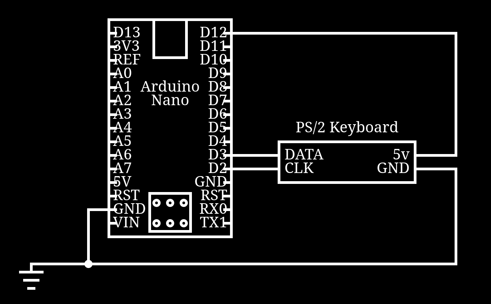

# PS/2 Interface

This a very simple PS/2 interface that I made just because I can.

Currently, it handles receiving bytes from the keyboard, though it
doesn't actually verify start/end bits properly since my keyboard doesn't
actually send the stop bit as a `1`?

It translates the scan codes into characters and prints them to the
serial monitor.

L/R Shift, L/R Ctrl, L/R Mod, L/R Alt are handled via a bitset and checked
when a keystroke is sent to be used for translation into text Shift
translates the keys to upper case or the key that is mapped on the
keyboard (i.e. `;` -> `:`).  Ctrl/Mod/Alt are translated into `<C-?>`,
`<S-?>`, `<M-?>`, respectively, where `?` is replaced with the character
pressed (i.e. `Ctrl + b` -> `<C-b>`).

## Circuit

The circuit is very simple, since hardware is connected directly to the
Arduino.

The only note that I have regarding the circuit is that the Keyboard's
PS/2 power is plugged directly into an Arduino output so we can turn it
on manually and see any startup output.  This also helps since PS/2 is
not officially hot-swappable.

## Future

This is only a small personal project, so I'll probably never finish
these things:

- [ ] Host -> Keyboard Communication
    - I've got a basic implementation, but it doesn't seem to be happy
      and never sends the ACK bit or clocks.  This may be because I
      have a _very_ cheap keyboard (8 USD on ebay) and it just doesn't
      work, or I'm doing something wrong.  (I'm leaning towards the
      latter)
    - [This page](http://www.burtonsys.com/ps2_chapweske.htm) has some
      very detailed information oh how the protocol should work, and
      I've implemented it as far as I can tell, though still no luck.
      It states that the host is supposed to time out at some point, but
      I've not implemented this functionality yet, so it just freezes.
- [ ] Caps/Scroll/Num lock
    - I'm waiting on fixing the above one before I do this, so that I
      can turn on the lights (:

## References

I heavily relied on a few different sites for information about the PS/2
spec and other aspects of this implementation.

- http://www.burtonsys.com/ps2_chapweske.htm
- http://www1.cs.columbia.edu/~sedwards/classes/2011/4840/ps2-keyboard.pdf
- https://wiki.osdev.org/PS/2_Keyboard
- https://www.networktechinc.com/ps2-prots.html

